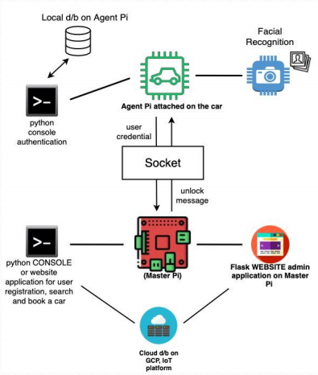

                    g0@@@@@@@@@@@@@@@@@@@@@8
                $@@@@@@@@@@@@@@@8888888@@@@@@>
             %@@@@X       @@@@@            @@@@%
            @@@^         @@@@@@              @@@g
         0@@@@          @@@@@@@`               @@@8 
       g@@@@@@@@@@@@@@@@@@@@@@@@@@@CLOUDCA@@@@@@@@@@@@@@@@@@@@@@@@@@@@@@@@@@@
      @@@@@@@@@@@@@@@@@@@@@@@@@@@@@@@@@@@@@@@@@@@@@@@@@@@@@@@@@@@@@@@@@@@
    @@@@@@@@@@@@@@@@@@@@@@@@@@@@@@@@@@@@@@@@@@@@@@@@@@@@@@@@@@@@@@@@@@@@
    @@@@@@@@@@@@@@@@@@@@@@@@@CLOUDCAR@@@@@@@@@@@@@@@@@@@@@@@@@@@@@@@@@@@@@@@@
    @@@@@@@@@@@@@@@@@@@@@@@@@@@@@@@@@@@@@@@@@@@@@@@@@@@@@@@@@@@@@@@@@@@@@@@@@8
     @@@@@@@@@@@@@@@@@@@@@@@@@@@@@@@@@@@@@@@@@@@@@@@@@@@@@@@@@@@@@@@@
             @@@@00@@@@@8@@@@@@@@@@@@@@@@@@@@@@@@@@@@@@@@@@@@@00@@@@
             C@@@00@@@@                                   @@@@00@@@
              ~@@@@@@@                                      @@@@@8

# Car-Share-System IoT Application
``` 
RMIT University Vietnam
Course: COSC2790 Programming Internet of Things
Semester: 2020A
Assessment: Assessment 2: Car Share IoT application
Student Name - ID: 
    1. Nguyen Thi Nguyet Minh  s3651351
    2. Nguyen Thanh Tam - s3747274
    3. Nguyen Quoc Cuong - s3748840
    4. Nguyen Thi Thuy Tien - s3757934
```
## Getting Started

This project has been built as an Python automation Car Share System to work with Raspberry Pi. The whole process includes a Master Pi (MP) and an Agent Pi (AP) serving four types of different users, which are customers, admin, manger and engineer. The final product includes a web application working with cloud database, a console based application and project documentation.

This document describes:

1. [Activities](#activities)

  * [Git Usage](#git) 
  * [Trello Usage](#trello) 

2. [Architecture](#architecture)

  * [Master Pi](#master-pi)
  * [Web application API endpoints](#web-application-api-endpoints)
    
      * [Cloud database](#-cloud-database)
      * [Clould database API end points](#clould-database-api-endpoints)
      
  * [Agent Pi](#agent-pi)
  * [Local database](#local-database)
  * [Object recognition](#object-recognition)
  * [Socket communication](#socket-communication)
  
3. [Instruction](#instruction)

  * [Master Pi](#master-pi-1)
  * [Agent Pi](#agent-pi-1)
  
4. [Acknowledgments](#acknowledgement)

## Activities

This project has been developed for around 6 weeks. Git, git hub, Trello, Google Drive have been used from the beginning of the project to manage the work and help contributors to collaborate with each other. 

### Git

#### Repository

This respository is private and shared between 4 contributors and 2 observers.

There are 15 different branches beside the default master. Contributors are using different branches to develop different components. Enventually, all the branches are mereged to the two seperate main branches, which are ap for Agent Pi Application and mp for Master Pi Application.

Review [distribution.txt](https://github.com/tienngthth/car-share-system/distribution.txt) for more work distribution details.

#### Activities

Contributors pull code from the appropriate branch everytime to continue working on the solution. Commit and push activities happen continuously after some new parts of the solution are coded serveral times per week or per day.

For the first half of the cycle, contributors worked on small, seperate components.

For the second half of the cycle, contributors merged the repaired components to the main branches (mp-test and ap) and work on the work flow.

### Trello

* Images go here

## Architecture




### Master Pi

Master Pi is a raspberry pi with a web application. 
* Allowing users to login and logout.
* Allowing customers to register new account, search and book availbe cars, review and cancel booking.
* Allowing admin to view, search, update, delete, create cars and customers as well as report backlog for broken cars.r. 
* Allowing engineer to view backlog map and detail as well as repair backlogs.
* Allowing manager to view 3 types of graphs.
* Talk to AP via socket communication for credential validation and car status update updation
* Store and retrieve all data from the cloud database via cloud database api end points.

#### Web application API endpoints

Below is the full list of web application end points.

0. Auth endpoints

    http://localhost:5000/login</br>
    http://localhost:5000/logout</br>
    http://localhost:5000/register</br>

1. Admin endpoints (admin login required)

   http://localhost:5000/admin/users</br>
   http://localhost:5000/admin/update/user</br>
   http://localhost:5000/admin/delete/user</br>
   http://localhost:5000/admin/cars</br>
   http://localhost:5000/admin/car/bookings</br>
   (http://localhost:5000/admin/create/car</br>
   http://localhost:5000/admin/update/car</br>
   http://localhost:5000/admin/delete/car</br>
   http://localhost:5000/admin/report/car</br>

2. Customer endpoints (customer login required)

   http://localhost:5000/customer/cars</br>
   http://localhost:5000/customer/book/car</br>
   http://localhost:5000/customer/confirm/booking</br>
   http://localhost:5000/customer/send/calendar</br>
   http://localhost:5000/customer/authorize</br>
   http://localhost:5000/customer/oauth2callback</br>
   http://localhost:5000/customer/bookings</br>
   http://localhost:5000/customer/bookings/details</br>
   http://localhost:5000/customer/bookings/cancel</br>

3. Engineer endpoints (engineer login required)

   http://localhost:5000/engineer/backlogs</br>
   http://localhost:5000/engineer/location</br>
   http://localhost:5000/engineer/close/backlog</br>

4. Manager endpoints (manager login required)

   http://localhost:5000/manager/dashboard</br>
   http://localhost:5000/manager/bar_chart</br>
   http://localhost:5000/manager/line_chart</br>
   http://localhost:5000/manager/pie_chart</br>

### Cloud database

Store and retrieve all data that can be retrieved via the designated api end points

#### Clould database API end points

Below is the full list of clould database end points.

1. Backlog endpoints

    http://localhost:8080/backlogs/create?assigned_engineer_id=&car_id&=status=&description=&</br>
    http://localhost:8080/backlogs/close?signed_engineer_id=&car_id=&</br>
    http://localhost:8080/backlogs/get/data</br>
    http://localhost:8080/backlogs/get/all</br>
    http://localhost:8080/backlogs/get/engineer/id?car_id=</br>
    http://localhost:8080/backlogs/remove/assigned/engineer?id=</br>
    http://localhost:8080/backlogs/remove/signed/engineer?id=</br>
    http://localhost:8080/backlogs/remove/car?car_id=</br>

2. Booking endpoints

    http://localhost:8080/bookings/create?customer_id=&car_id=&rent_time=&return_time=&total_cost=</br>
    http://localhost:8080/bookings/update?status=&id=</br>
    http://localhost:8080/bookings/read?car_id=&customer_id=</br>
    http://localhost:8080/bookings/get/profit/data</br>
    http://localhost:8080/bookings/get/most/profit</br>
    http://localhost:8080/bookings/get/data</br>
    http://localhost:8080/bookings/get/longest/duration</br>
    http://localhost:8080/bookings/get/all?car_id=&customer_id=</br>
    http://localhost:8080/bookings/get/by/time?car_id=&customer_id=&start=&end=</br>
    http://localhost:8080/bookings/remove/customer?customer_id=</br>
    http://localhost:8080/bookings/remove/car?car_id=</br>

3. Car endpoints

    http://localhost:8080/cars/create?mac_address=&brand=&type=&location_id=&status=&color=&seat=&cost=</br>
    http://localhost:8080/cars/update?mac_address=&brand=&type=&location_id=&status=&color=&seat=&cost=&id=</br>
    http://localhost:8080/cars/read?mac_address=&brand=&type=&status=&color=&seat=&cost=&id=</br>
    http://localhost:8080/cars/status/available?mac_address=&brand=&type=&status=&color=&seat=&cost=&id=</br>
    http://localhost:8080/cars/get/id?mac_address=</br>
    http://localhost:8080/cars/history?id=</br>

4. Customer endpoints

    http://localhost:8080/customers/create?username=&password=&first_name=&last_name=&email=&phone=</br>
    http://localhost:8080/customers/read?username=&password=&first_name=&last_name=&email=&phone=&id=</br>
    http://localhost:8080/customers/update?username=&password=&first_name=&last_name=&email=&phone=&id=</br>
    http://localhost:8080/customers/delete?id=</br>
    http://localhost:8080/customers/get/id?username=</br>
    http://localhost:8080/customers/check/existed/username?username=</br>

5. Location endpoints

    http://localhost:8080/customers/location/get?id=

6. Staff endpoints

    http://localhost:8080/staffs/read?id=&username=&first_name=&last_name=&email=&phone=&user_type=</br>
    http://localhost:8080/staffs/check/existed/username?username=</br>
    http://localhost:8080/staffs/get/engineer/mac/address?id=</br>


### Agent Pi

Agent Pi is a raspberry pi with a console-based application. 
* Allowing customer to login (credential or facial login), logout and return the car. Customer credential is stored temporarily in the local database while the customer is using the car. 
* Checking for car maintainance and scanning for engineer device mac address. Allowing engineer to repair and return the car.
* Talk to MP via socket communication for credential validation and car status update updation.


### Local database

The local database is used to store the customer credential after successfully validated by the MP.

### Object recognition

Facial recognition and code detection techniques have been utilized for login function and close backlog function. The system can recognise all the trained user faces as well as retrieving a qr code content.

### Socket communication

MP and AP talk to each other via socket communication with MP as a server and AP as a client. The communication is using TCP protocal which requires connection establishment.

## Instruction

Review [requirements.txt](https://github.com/tienngthth/car-share-system/requirements.txt) to make sure all packages have been installed. 

### Master Pi

1. Download the mp-test branch.
2. Run ./run.sh in your console to initiate the web application, the cloud database connection, the cloud database APIs and the server socket.
3. Access to web application at localhost:5000, please use Google Chrome Browser.</br>
    A customer credential: tiennguyen | 2@aA2222</br>
    The admin credential: minh_nguyen | 2@aA3333</br>
    The manager credential: tam_nguyen | 3#aA4444</br>
    The engineer credential: cuong_nguyen | 1!aA2222</br>

#### Authentication use cases
```
User is asked to input username and password to login.
```

```
Customer can register for new account given all fields are filled with the correct format.
* Username must contain at least 6 characters, all are letters.
* Password must contain at least 8 chracters with at least 1 upper case letter, 1 lower case letter, 1 number, 1 special character. Password is encrypted with salting and hashing technique before being saved.
* Standard email format regex is applied.
* Phone must contain all number with the length equal to or greater than 5.
```

```
User can log out.
```

#### Customer use cases
```
Customer is required to input intended booked duration in order or to view all __available__ cars at the time range. 
*Start date must be after today and smaller than end date. Duration must be greater than 1 day.
*Cost must be a valid float number.

Customer can search for cars by max cost, seat, type, brand, color filter.
```

```
Customer can view the booking detail and is asked to confirm or cancel the new bookinng.
After confirm booking, customer is asked to log in to calendar in order to create an event.
```

```
Customer can view all booking history and can filter the bookings by date.
Customer can view the detail of any booking and can cancel any **Booked** booking.
```

#### Admin use cases
```
Admin can view all cars or search for cars by brand, type, cost, color, seat, status, and mac address.
*Start date must be after today and smaller than end date. Duration must be greater than 1 day. 
*Cost must be a valid float number.

Admin can view any car booking history.
```

```
Admin can create a new car with all fields filled including brand, type, cost, color, seat, mac address, and car park no, or update any car detail.
*Cost must be a valid float number.
```

```
Admin can report a car with a form to input description. An emai is sent to engineer to for new backlog announcement. Car status is set to *To be repaired*.
```

```
Admin can delete a car. The system set the car id field of all backlogs and bookings with deleted car to none.
```

```
Admin can view all users or search for users by username, email, phone, user type filter.
```

```
Admin can create a new user with all fields filled or update any user detail.
* Username must contain at least 6 characters, all are letters.
* Password must contain at least 8 chracters with at least 1 upper case letter, 1 lower case letter, 1 number, 1 special character. Password is encrypted with salting and hashing technique before being saved.
* Standard email format regex is applied.
* Phone must contain all number with the length equal to or greater than 5.
```

``` 
Admin can delete a user. 
* The system set the customer id field of all bookings with deleted customer to none.
* The system set the engineer id field of all backlogs with deleted engineer to none.
```

#### Engineer use cases
```
Engineer can view all backlogs.
Engineer can view a backlog detail including the location map.
Engineer can repair a car and update the backlog status to 'Done' and update the car status back to 'Availabe' if no backlog left for this car.
```

#### Manager use cases
```
Manager can view three type of graphs.
1. Profit by date (Line chart)
2. Most booked cars (Bar chart)
3. Most repaired cars (Pie chart)
```

### Agent Pi

1. Download the ap branch.
2. Run ./mainMenu.py in your console to start the console based application.


#### Authentication flow
```
First, the application asks if the user is a customer or an engineer in the Main menu.
The customer is directed to the Customer Menu.
AP starts scanning for engineer after receiving the signal in order to prevent the accident when the engineer doens't mean to repair the car.</br>
```

#### Customer flow

```
The customer is then asked for login preference (facial, credential, back to the main menu).
* The customer inputs both username and password for credential log in.
* The customer inputs password only after the system recognise the customer. 

If invalid credential, the customer is directed to the login preference menu.

For the first time login:
* AP will send the credential info (username, password and car id) to the MP for validation.
* AP will send a message to MP in order to update car status to Unavailable and booking status to Done.
After the first login, the application saves the user credential (with the password encrypted) to the local database and allow offline login.
```

```
Customer now has option to lock the car or to return the car.
* AP will send a message to MP in order to update the car status back to Available when customer returns the car.
* Customer is directed to the Main Menu after selecting option to lock the car.
```

#### Engineer flow

```
AP sends a message to MP to check for the car status, if the car need to be repaired, then the MP sends back the engineer mac address.
AP starts scanning for the mac address and open the car for the engineer.
If no maintainance needed or no engineer device found, car won't be unlocked.
```

```
Engineer now has options to scan for qr code to close all backlogs of the car or lock the car.
The engineer is directed back to the main menu after selecting lock car option.
If the engineer select to scan for QR code, camera is opened and starts detecting code.
If the code has required information, AP will send a message to MP to close all backlog of the car and update car status to 'Available'.
```

## Unit test

We have around 100 test cases covering the CRUD scenarios for all the entities of the cloud database api end points including customers, staffs, cars, bookings, backlogs, locations.

1. Download the mp-test branch.
2. Run ./run.sh in your console to initiate the web application, the cloud database connection, the cloud database APIs and the server socket.
3. Run python ./cloud/unittest/test_suite.py in your console to run the test suite and view the results.

## Acknowledgments

* please include acknoledgements for all the technologies: google calendar, cloud, facial, ...

